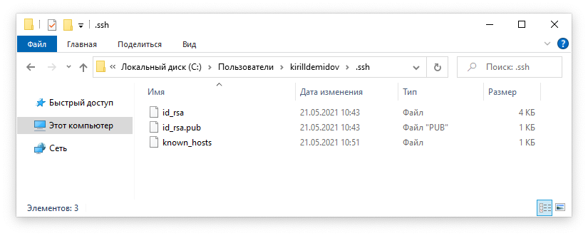
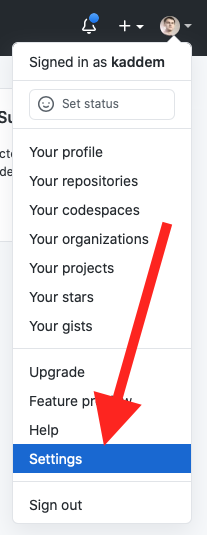
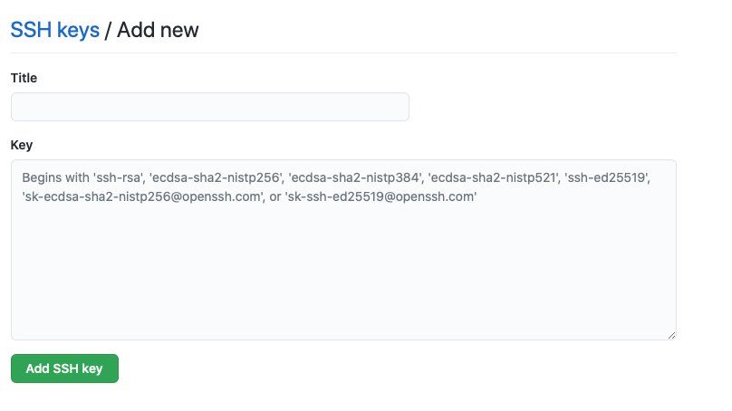
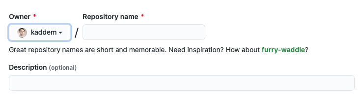
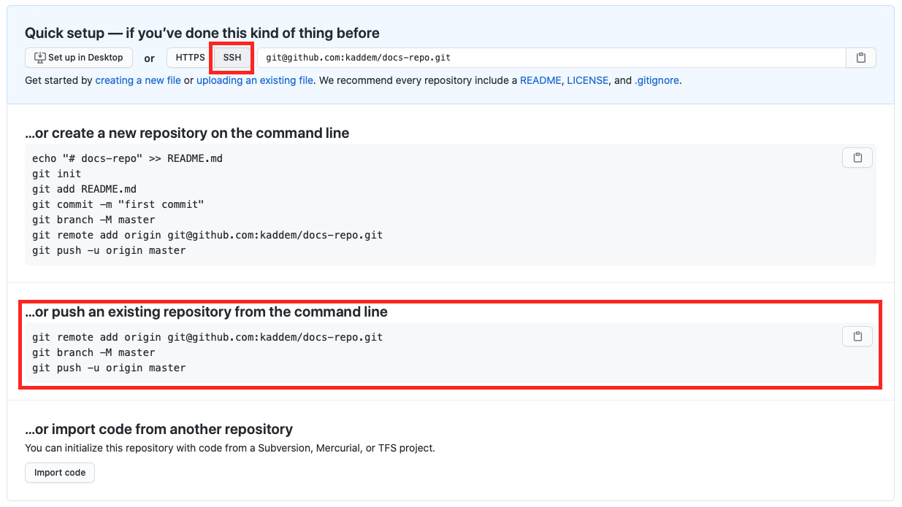
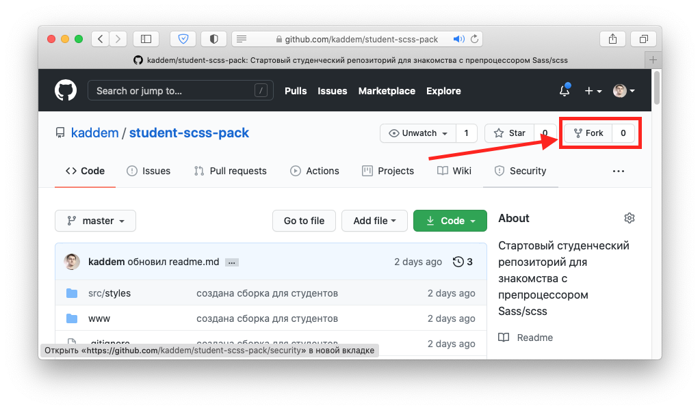
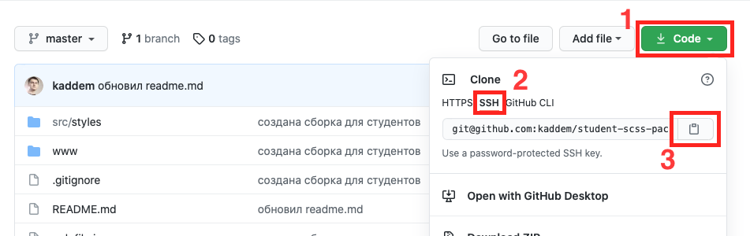

# Работа с Git

**Git** - система контроля версий.

## Задачи Git

- сохранять историю изменений в проекте.
- дать возможность откатиться к более ранним сохраненным состояниям при необходимости.
- при совместной работе над одним проектом двух и более человек, НЕ дать разработчикам затереть код, написанный коллегой.
- иметь резервную копию проекта

## Git-репозиторий

Просто католог файловой системы - обычная папка в которой находяться файлы проекта. Только Git'у "сказали" работать в этой папке и сдедить за всеми изменениями в файлах этой папки, что бы можно было их сохранять.

### Локальный репозиторий

**Локальный репозиторий** - та самая папка проекта с работающим в ней Git'ом и расположенная локально на твоем личном компьютере.

Когда над проектом работает несколько человек - у каждого на его компьютере своя локальная копия репозитория.

Разработчики могут находиться в разных городах/странах/континентах. Как же происходит синхронизация изменений в проекте между локальными репозиториями разработчиков?

Через удаленный репозиторий.

### Удаленный репозиторий
**Удаленный репозиторий** - та же самая папка проекта размещенная на удаленном сервере.

Как работает схема:

1. Сохраняешь изменения в локальном репозитории - это называется **коммит** (от названия консольной команды ```git commit```). Часто можно услышать фразу - "Сейчас заккомичу!" - т.е. сохраню внесенные изменения в проекте в git'е
2. Отправляешь изменения на удаленный сервер - это называется **запушить** (от названия консольной команды ```git push```).
3. Другой разработчик скачивает изменения из удаленного репозитория к себе в локальный - говорят **стянуть** или **пульнуть** (от названия консольной команды ```git pull```)

В нашем случае роль удаленного репозитория выполняет сервис [github](https://github.com).

Нет аккаунта на github - скорее всего тебе нужно в предыдущий раздел про [настройку окружения](../settings/). Иди туда, полностью все настраивай и только после этого возвращайся сюда)

<br>

## SSH протокол

Нужен для безопасной передачи данных между локальным и удаленным репозиториями. Использование ssh соединения один из способов и мы будем пользоваться им.

Для этого нужно создать пару ssh-ключей - приватный и публичный. Приватный будет храниться на твоем компьютере, а личный указан в настройках на github.

<br>

### Создание SSH ключа

1. Открой терминал (```Git bash для Windows``` / ```Встроенный терминал для Mac```)
2. Выполни команду:
```bash
ssh-keygen -t rsa -b 4096 -C "your_email@example.com"
# где your_email@example.com - почта на которую регистрировал аккаунт на github
# Эту же почту указывал, настраивая Git сразу после установки
```
3. Терминал предложит указать месторасположения ssh ключа. Просто жми ```enter```:
```bash
> Enter a file in which to save the key (/c/Users/you/.ssh/id_ed25519):[Press enter]
```
4. Предложат ввести пароль - придумай и введи его:
```bash
> Enter passphrase (empty for no passphrase): [Type a passphrase]
# при вводе пароля символы и/или * видны не будут - это сделано для безопасности.
```
5. Введи пароль повторно:
```bash
> Enter same passphrase again: [Type passphrase again]
# при вводе пароля символы и/или * видны не будут - это сделано для безопасности.
```

По умолчанию ssh-ключи будут созданы в папке пользователя в скрытой подпапке .ssh:
```bash
/c/Users/your-user-name/.ssh/ #для Windows
/Users/your-user-name/.ssh/ #для Mac
```


Два файла типа ```id_*``` и ```id_*.pub``` - и есть ключи. Файл с расширенийм ```*.pub``` содержит публичный ключ - его добавь на github.

<br>

### Добавление ssh-ключа на github

1. Любым известным тебе способом скопируй все **содержимое** файла публичного ключа ```id_*.pub``` в буфер обмена.
2. Зайди в настройки аккаунта github:

3. В левом боковом меню выбери пункт ```SSH and GPG keys```
3. Нажми на первую зеленую кнопку ```New SSH key```
4. В поле ```title``` введи название ключа. Любое, что бы понять что за ключ - "Home computer", "My win notebook", "Work laptop". У тебя может быть несколько компьютеров - для каждого устройства нужно делать уникальную пару ssh-ключей.
5. В поле ```key``` вставь все содержимое файла публичного ключа ```id_*.pub```

6. Нажми зеленую кнопку ```Add SSH key```
7. Спроси у бабушки на какой полке лежат пирожки

Поздравляю - безопасное ssh-соединение с github настроено.

<br>

## Создание Git-репозитория

Существует два варианта:

1. Сделать репозиторий с нуля
2. Создать репозиторий из заготовки уже размещенной на удаленном репозитории

Оба варианта подразумевают создание пустого удаленного репозитория на github.

### Создаем репозиторий на github

1. Нажми на  ```+``` в правом верхнем углу интерфейса github и выбери ```New repository```
2. Введи название репозитория. Для учебного проекта по шаблону ```name-project-surname```, где ```surname``` - твоя фамилия:

3. В ```description``` короткое емкое описание проекта (желательно)
4. Чекбоксы ниже не ставь.
5. Жми зеленую кнопку ```Create repository```
6. Увидишь результат - убедись, что переключатель сверху стоит в положении ```ssh```:

7. Не закрывай вкладку. Тебе будут нужны три команды - на скриншоте выше обведены красным

### Вариант 1 - с нуля

Coming soon...

### Вариант 2 - из заготовки

На курсе нам интересен этот вариант - мы будем использовать [заготовку для учебного проекта](https://github.com/kaddem/student-scss-pack):

1. Форкни этот репозиторий, т.е. сделай копию заготовки в своем аккаунте на github. Нажми справа вверху кнопку ```Fork```:

2. Склонируй свой форк. Склонировать, значит скачать себе на компьютер все содержимое удаленного репозитория, сделав тем самым локальную копию. Нажми зеленую нопку ```code (1)```, далее переключатель в состояние ```ssh (2)``` и скопируй путь ```(3)```:

3. В терминале перейди в папку под свои проекты.
4. Введи команду:
```bash
git clone и-путь-из-пункта-2 название-папки-проекта
# что-то типа:
# git clone git@github.com:kaddem/student-scss-pack.git sand-smile-demidov
# название-папки-проекта - название созданного выше пустого
# репозитория на github


# будет создана папка "sand-smile-demidov" и
# в нее скачано все содержимое заготовки
```
5. Перейди в папку проекта:
```bash
cd название-папки-проекта
```
6. Введи команду:
```bash
rm -rf .git # удалим папку .git/
# Так мы разорвем связь с удаленным репозиторием заготовки,
# удалим историю коммитов создателя заготовки и
# уничтожим сам гит-репозиторий
```
7. По новой инициализируй гит-репозиторий
```bash
git init
```
8. Добавь все файлы в отслеживание и сделай коммит
```bash
git add . # Добавляем все файлы в отслеживание
git commit -am "Сообщение коммита"
```
9. Вернись в браузере к странице с созданным пустым репозиторием.
Выполни в терминале, в точности как указано именно у тебя в браузере, три команды по очереди (обведены на скриншоте):

```bash
git remote add ... #свяжет локальный репозиторий с удаленным пустым

#остальные запушат его.
```

Поздравляю - ты развернул локальный репозиторий под учебный проект на базе заготовки и запушил его в удаленный репозиторий

