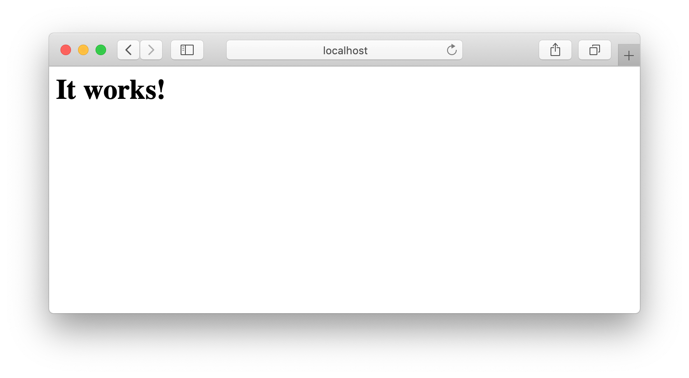
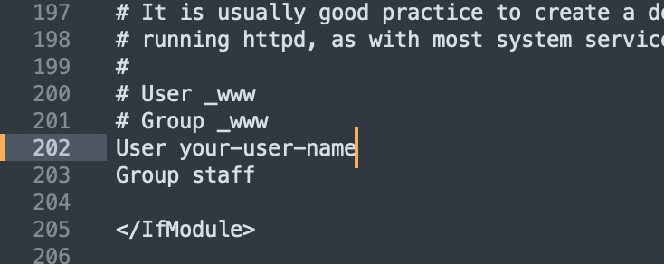
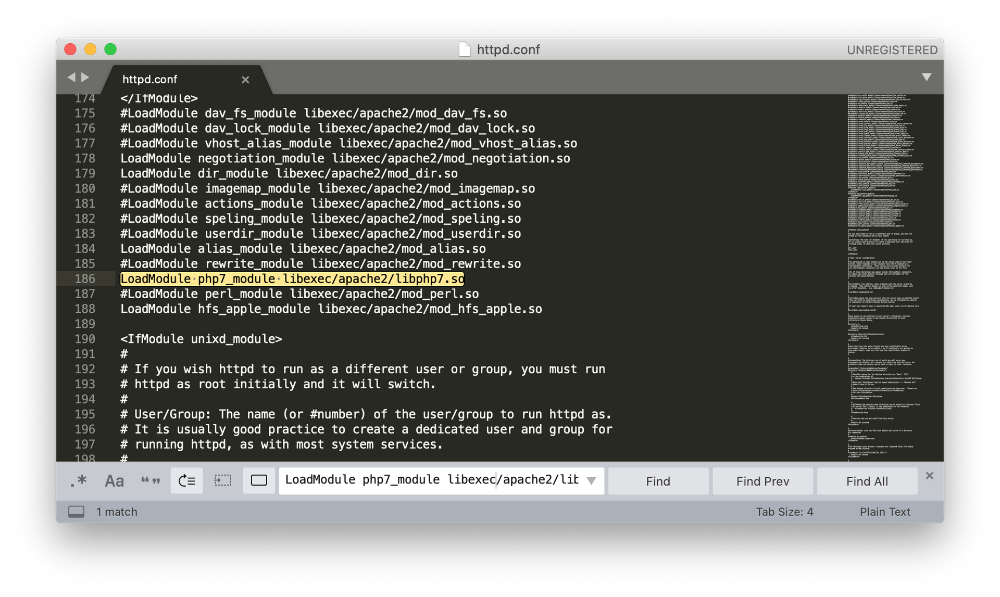
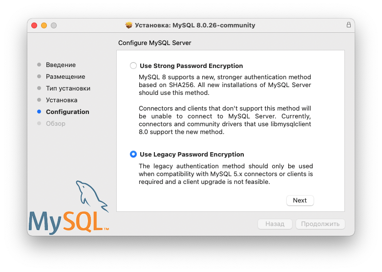
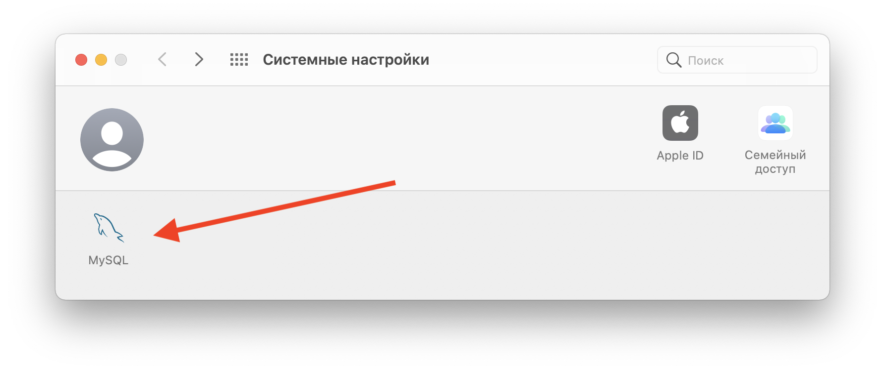

# Локальный сервер на macOS

Есть два варианта поднять локальный сервер на mac:

1. Установить сторонний готовый серверный пакет
2. Использовать встроенный сервер ```Apache```

Первый вариант в топку - смысл ставить что-то стороннее, если есть встроенное в систему. О втором варианте ниже.

## Запуск сервера Apache

1. Выполни в терминале команду:
```bash
sudo apachectl start
# не забудь ввести пароль - тот что для входа при старте компа.
# юзаешь отпечаток пальца - придется вспомнить пароль
```
> не знаешь что такое `sudo` или `apachectl`? Не тупи \- иди гугли! Разберешься \- вертай сюда назад.
> Не знаешь что такое `start` \- купи [словарь](https://www.ozon.ru/context/detail/id/5817303/)

2. Введи пароль, который юзаешь для входа в систему. Когда будешь вводить, в консоли ничего не измениться, как будто строка пустая и каретка не двигается \- это норма при вводе пароля! Ввел \- не забудь Enter жмакнуть.

3. Проверь, что сервак стартанул. Иди в браузер, вводи url `http://localhost`. Должно быть так:

> Файлы localhost'а лежат в директории `/Library/WebServer/Documents`.

Теперь сервер должен стартовать сам при запуске компа - проверь это.

<br>

## Решение проблем с правами доступа

В macOS куча системных/технических пользователей/ролей о которых обычный юзер не знает - это сделано для безопасности системы.
Например, сервер Apache будет вносить изменения на диске от имени пользователя ```_www```.
Но у него нет прав на запись в папке ```/Users/your-user-name```.
Нам такой доступ потребуется. Для этого отредактируем файл конфигурации Apache ```/etc/apache2/httpd.conf```:


1. Открой данный файл через терминал в редакторе Sublime Text:
```shell
subl /etc/apache2/httpd.conf
```
> Если эта команда не сработала, иди в раздел [настройка окружения](../settings) и смотри пункт про Sublime text
2. В файле ```/etc/apache2/httpd.conf``` найди и закомментируй строки поставив ```#``` перед ними:
```bash
# User _www
# Group _www
```
3. Сразу под ними напиши еще две строки:
```bash
User username # Где username - имя твоего пользователя в системе
Group staff
```


4. Сохрани файл.

5. Перезапусти сервак:
```bash
sudo apachectl restart
```

Теперь апач будет вносить изменения от твоего имени. И не нужно будет возиться с правами доступа к директориям.

<br>

## Установка PHP

Дежавю. PHP уже есть в системе. Включи его поддержку, отредактировав файл конфигурации Apache ```/etc/apache2/httpd.conf```:

1. Открой данный файл через терминал в редакторе Sublime Text:
```bash
subl /etc/apache2/httpd.conf
```

2. Раскомментируй строку, отвечающую за загрузку модуля *php7_module* `LoadModule php7_module libexec/apache2/libphp7.so`, удалив перед строкой символ #:


3. Так же раскомментируй строку:
```bash
LoadModule rewrite_module libexec/apache2/mod_rewrite.so
```

4. Сохрани файл.

5. Конфигурация сервака изменилась. Что бы изменения применились, перезапусти сервак:
```bash
sudo apachectl restart
```

<br>

## Установка MySQL

Скачай [Community версию MySQL](https://dev.mysql.com/downloads/mysql/)

1. Внимательно выбери DMG архив под нужный тебе процессор (intel или apple silicone).
2. Предложат зарегаться или войти - не делай это. Просто нажми ниже на "No thanks, just start my download."
3. Запусти установку скачанного dmg-пакета и соглашайся со всеми пунктами по умолчанию до пункта "Configuration". В нем выбери второй вариант - "Use Legasy..." и жми кнопку next:

4. Придумай пароль для базы данных и запомни его, а еще лучше запиши! Профукаешь - все пропало.
5. Поставь галочку запуска MySQL при старте компа, что бы каждый раз не заходить в настройки и не запускать вручную.
6. В настройках системы должен появиться пункт MySQL - проверь это. Можешь жмакнуть на него и посмотреть что сервер баз данных работает


## Установка phpMyAdmin

phpMyAdmin (как пишет википедия) - веб-приложение с открытым кодом, написанное на языке PHP и представляющее собой веб-интерфейс для администрирования СУБД MySQL.

И оно нам понадобится.

1. Зайди по адресу [http://localhost/phpmyadmin/](http://localhost/phpmyadmin/). Если видишь форму для входа - phpMyAdmin установлен и следущие пункты данного списка игнорируй. В противном случае... см. п. 2
2. [Скачай архив](https://www.phpmyadmin.net/downloads/) phpMyAdmin с официального сайта и разархивируй его.
> Далее будет предполагаться, что архив был скачан и разархивирован в папку загрузок (Downloads).
> Теперь в загрузках есть папка типа ```phpMyAdmin-5.1.1-all-languages``` с кучей файликов внутри
3. Установи phpMyAdmin в директорию виртуального хоста(сайта) localhost - ```/Library/WebServer/Documents/```.
Для этого введи в терминале команду, с поправкой на название получившейся в предыдущем пункте папки в загрузках:
```shell
sudo mv ~/Downloads/phpMyAdmin-5.1.1-all-languages/  /Library/WebServer/Documents/phpmyadmin
# команда mv (от move) - переместит папку из загрузок в нужное место и заодно переименует ее.
```
4. Проверь корректность выполнения предыдущей операции - выполни команду:
```shell
cd  /Library/WebServer/Documents/phpmyadmin/
# если перешёл в указанную директорию и нет ошибок - все отлично.
```
5. Перезапусти сервак:
```bash
sudo apachectl restart
```
6. Зайди по адресу [http://localhost/phpmyadmin/](http://localhost/phpmyadmin/). Если видишь форму для входа - phpMyAdmin установлен.

## Настройка виртуальных хостов

### Редактируем httpd.conf

1. Открой файл конфигурации Apache ```/etc/apache2/httpd.conf``` в редакторе, например так:
```bash
subl /etc/apache2/httpd.conf
```

2. Найди строку ```#Include /private/etc/apache2/extra/httpd-vhosts.conf``` и добавь под ней новую:
```bash
Include /private/etc/apache2/vhosts/*.conf
```

3. Сохрани изменения и закрой файл.

Ты добавил директиву - Apache будет искать настройки для локально разрабатываемых сайтов в файлах с расширением .conf из директории ```/private/etc/apache2/vhosts```. Для каждого сайта - свой файл ```*.conf```

### Настройка виртуального хоста по умолчанию

1. Создай директорию ```/private/etc/apache2/vhosts``` -  ты добавил директиву с путем до нее выше, но физически такой папки на диске нет. Исправь это:
```bash
sudo mkdir /private/etc/apache2/vhosts
```

2. Перейди в эту директорию:
```bash
cd /private/etc/apache2/vhosts/
```

3. Создай файл ```_default.conf```:
```bash
sudo touch _default.conf
```

4. Открой этот файл в редакторе:
```bash
subl _default.conf
```

5. Пропиши в нем конфигурацию по умолчанию:
```text
<VirtualHost *:80>
DocumentRoot "/Library/WebServer/Documents"
</VirtualHost>
```

6. Сохрани и закрой файл.

7. Перезапусти сервак:
```bash
sudo apachectl restart
```

8. Открой в браузере url `http://localhost`. Если нет ошибок и выглядит как на скрине - все идет как надо:


<br>

## Настройка хоста для сайта

> Инструкцию из этого раздела придется выполнять каждый раз при старте разработки бекенда для очередного нового сайта.

### Подготовка
Договоримся, что директории для локально разрабатываемых сайтов будем размещать в директории sites домашней папки (твоя папка пользователя) - ```Users/your-user-name/sites```

1. Создай папку ```test-site```:
```shell
mkdir ~/sites/
mkdir ~/sites/test-site/
```
2. Перейди в созданную папку и создай там файл index.html и открой его
```shell
cd ~/sites/test-site/
touch index.html
subl index.html
```
3. Добавь в index.html базовую html разметку. И напиши что-нибудь в ```body```

Ты создал небольшой тестовый проект, который далее будешь запускать через локальный сервак Apache.

### Настройка хоста для сайта

Для примера твой сайт будет открываться по домену ```http://test-site.local```:

1. Перейди в папку ```/private/etc/apache2/vhosts/```:
```shell
cd /private/etc/apache2/vhosts/
```
2. Создай файл ```test-site.local.conf```:
```shell
sudo touch test-site.local.conf
```
3. Открой его в редакторе:
```shell
subl test-site.local.conf
```
4. Введи в файле:
```shell
<VirtualHost *:80>
	DocumentRoot "/Users/your-user-folder/sites/test-site"
	ServerName test-site.local
	ErrorLog "/private/var/log/apache2/test-site.local-error_log"
	CustomLog "/private/var/log/apache2/test-site.local-access_log" common
	<Directory "/Users/your-user-folder/sites/test-site">
		AllowOverride All
		Require all granted
	</Directory>
</VirtualHost>
# где your-user-folder - имя папки твоего пользователя
# где test-site - название сайта
```
5. Сохрани файл.
6. Перезапусти сервак:
```shell
sudo apachectl restart
```
7. Открой файл ```/etc/hosts```
```shell
subl /etc/hosts
```
8. Добавь в него строку ```127.0.0.1  test-site.local```
9. Сохрани файл
10. Перейди в браузере по адресу [http://test-site.local/](http://test-site.local/)
