# Локальный сервер на Windows

В Windows отсутствут встроенный локальный сервер - придется скачать и настроить его.

## Open Server

Скачай [Open Server](https://ospanel.io/download/)

> Open Server бесплатен. Его делают прекрасные люди для нас разработчиков - задонать им от 60р и скажи спасибо!
>
> Жмот? Скачивай долго на низкой скорости.

## Установка Open Server

1. Запусти скачанный файл. Во время установки будь внимателен - выбирай пункты как ниже в инструкции. Если какой-то шаг в инструкции отсутствует - оставь все по умолчанию и переходи к следующему.

2. Выбери место для установки. Рекомендую оставить предложенный вариант:
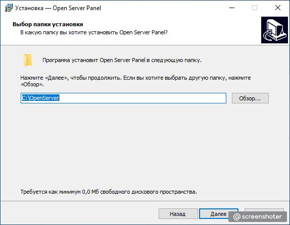

3. Выбери компактную установку:
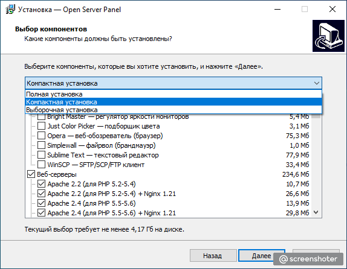

4. Скорее всего будет запущена установка дополнительных пакетов, необходимых для работы сервера. Она может занять некотрое время - терпеливо дождись окончания:
 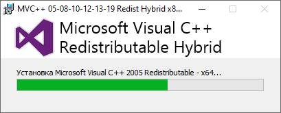

5. Предложат перезагрузить компьютер - перезагрузи.

Поздравляю - Open Server установлен.

## Запуск Open Server

1. Перейди в папку, где установлен Open Server. Запусти единственный *.exe файл:
 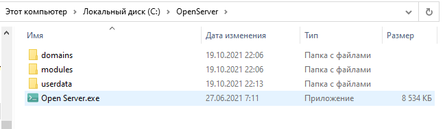
2. Выбери подходящий язык
3. В трее (внизу справа на панели со значками) найди красный флажок:
 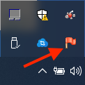
4. Нажми на него - откроется меню Open Server. Выбери пункт - "Запустить":
 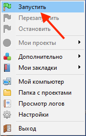
5. Брендмауер что-то там заблокирует. Не слушай его и разреши доступ:
 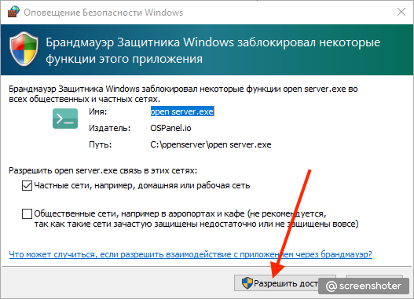
6. В меню Open Server найди пункт - "Мои проекты". Выбери единственный вариант - "localhost":
 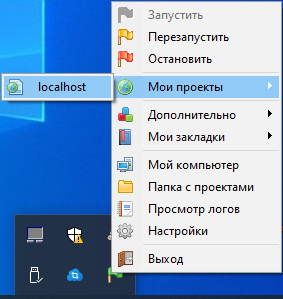
7. Откроется вкладка браузера. Если в ней что-то подобное, то все отлично:
 

Open Server запускается и работает - съешь коврижку.

## Включение модуля MySQL

Нам нужна база данных MySQL. Нужно ее включить в настройках сервера, подключив соответствующий модуль:

1. Зайди в настройки Open Server:
 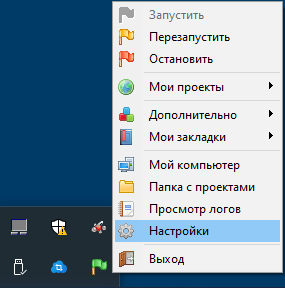
2. В открывшемся окне выбери вкладку "Модули". В пункте MySQL выбери версию 5.7
 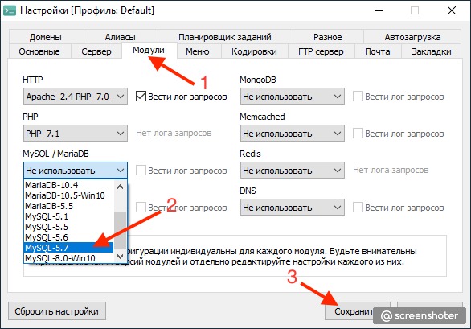
3. Сохрани изменения. Программа скорее всего скажет, что перезапустит сервер - дай ей это сделать.
4. Проверь, что модуль подключился. Иди в пункт "Дополнительно". В нем увидишь подпункт PhpMyAdmin:
 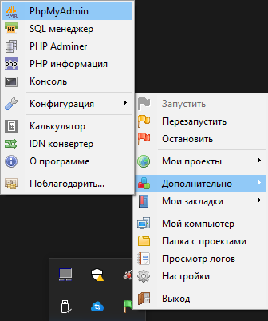
5. Запусти его - откроется вкладка браузера. Введи имя пользователя - "root". Пароль оставь пустым и "Вперед":
 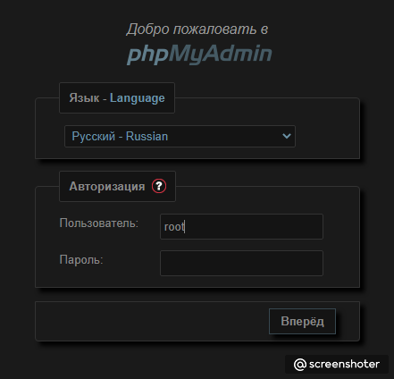
6. Если видишь очень похожее на это - модуль MySQL корректно подключен:
 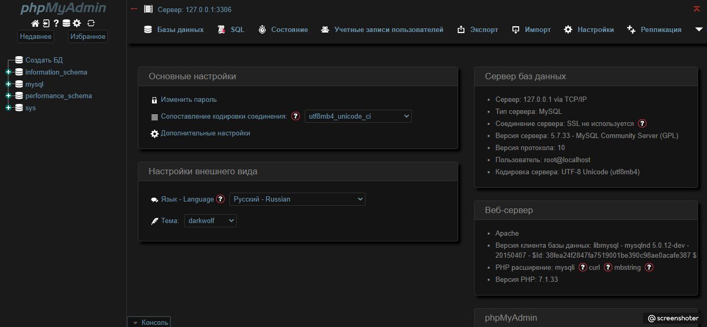

 
 
Тобой скачан, установлен, настроен и запущен OpenServer - заточи бублик!
 

